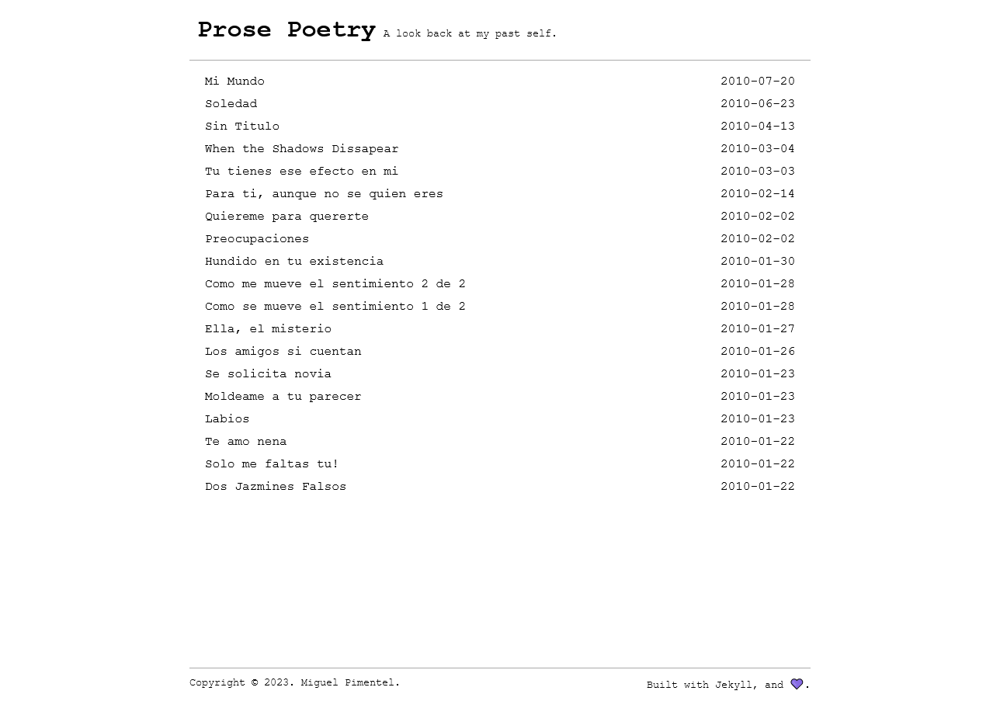

  
  
  
  
  

# Prose Poetry

"Prose Poetry" holds the source code for my old Blog in Spanish. All articles contained herein were written in the first half of 2010. It is generated using [Jekyll](https://jekyllrb.com/), and themed with [Jekyll-Paper](https://github.com/ghosind/Jekyll-Paper). The canonical source can be found [here](https://elandres.wordpress.com/).

> Prose poetry is poetry written in prose form instead of verse form, while preserving poetic qualities such as heightened imagery, parataxis, and emotional effects.

## Screenshot

## License

Source code is available under [MIT](LICENSE).
